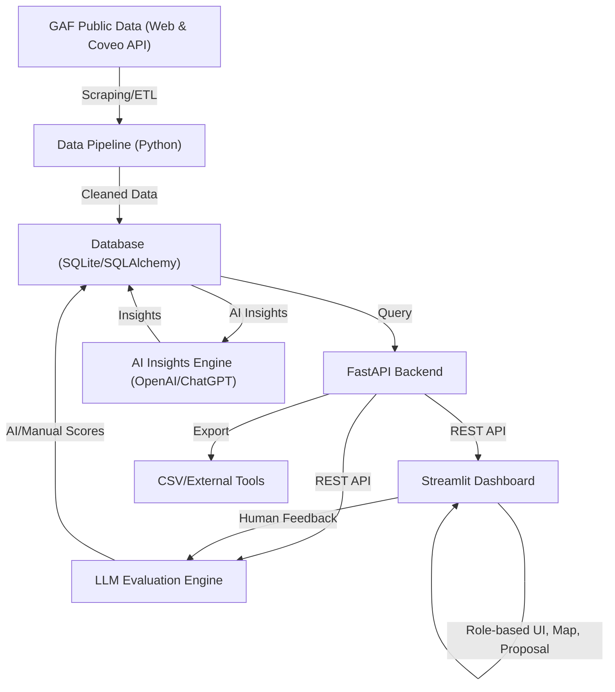

# GAF Sales Intelligence Platform

## Case Study Context

This project is a case study for an AI-powered B2B sales intelligence platform, designed for a roofing distributor's sales team. The platform leverages public data sources (notably GAF) to pre-generate actionable sales insights and recommendations, helping sales teams identify, understand, and effectively engage with decision-makers.

- **Data Source:** https://www.gaf.com/en-us/roofing-contractors/residential?distance=25 (ZIPCODE: 10013)
- **Project Scope:**
  1. **Data Collection System:** Scalable web scraping focused on contractor info
  2. **Data Processing Pipeline:** ETL for cleaning, structuring, and maintaining data quality
  3. **AI Insights Engine:** ChatGPT integration to pre-generate actionable insights (summaries, industry types, talking points)
  4. **LLM Evaluation Framework:** Strategy and metrics for assessing insight quality and usefulness
  5. **Backend:** Efficient, concurrent, and consistent data storage and API
- **Success Criteria:**
  1. Architecture design and scalability
  2. Data collection efficiency and compliance
  3. Quality and actionability of AI-generated insights
  4. Robustness and effectiveness of LLM evaluation

## System Architecture

## Module Overview

### 1. Data Collection & ETL
- **Scraper:** Fetches contractor data from the GAF Coveo API and web, supporting pagination, ZIP code filtering, and concurrency.
- **ETL Pipeline:** Cleans, deduplicates, and loads data into the database. Logs data quality issues and supports versioning.

### 2. Database
- **SQLAlchemy ORM:** Defines the `Contractor` model and manages all data persistence in a local SQLite database (easily switchable to Postgres).

### 3. AI Insights Engine
- **OpenAI Integration:** Generates English-language sales insights for each contractor and stores them in the database.
- **Prompt Engineering:** Prompts are iteratively refined for actionable, relevant, and clear insights.

### 4. LLM Evaluation Framework
- **Self-Evaluation:** Uses OpenAI to rate each insight on relevance, actionability, accuracy, and clarity, with comments.
- **Manual Evaluation:** Streamlit UI allows human feedback and comments for continuous improvement.

### 5. Backend API
- **FastAPI:** Exposes endpoints for advanced contractor queries, filtering, and CSV export. Includes Swagger UI for easy testing.

### 6. Dashboard & Visualization
- **Streamlit Dashboard:** Business-friendly UI for data exploration, filtering, visualization, and export. Includes map-based exploration, role-based insight display, and proposal generation.
- **Visualization Scripts:** Analyze and plot evaluation score distributions.

## Evaluation Methodology
- **Automated LLM Evaluation:** Each AI-generated insight is scored by an LLM on four dimensions (relevance, actionability, accuracy, clarity) and receives a comment.
- **Manual Review:** Human evaluators can review and comment on insights via the Streamlit UI.
- **Feedback Loop:** Low-scoring insights can be regenerated with improved prompts, and human feedback is used to further tune the system.

## Highlights & Extensibility
- **Modular Design:** Each component (scraper, ETL, AI, API, dashboard) is decoupled and easily replaceable or upgradable.
- **Scalable Data Pipeline:** Supports concurrent scraping and can be scheduled for regular updates.
- **Flexible Database:** ORM-based, so switching to Postgres or other RDBMS is straightforward.
- **AI-Driven Insights:** Integrates LLMs for both insight generation and evaluation, with a feedback loop for continuous improvement.
- **Business-Ready UI:** Streamlit dashboard enables non-technical users to explore, filter, and export data easily.
- **Extensible Evaluation:** Supports both automated and manual evaluation, and can be extended to more metrics or external review systems.

---

**Quick Start:**
1. Install dependencies: `pip install -r requirements.txt`
2. Run the data pipeline: `python gaf_scraper.py` and `python etl.py`
3. Generate AI insights: `python ai_insights.py`
4. Start the API: `uvicorn api:app --reload`
5. Launch the dashboard: `streamlit run dashboard.py`

For more details, see the code comments and each module's docstring. 